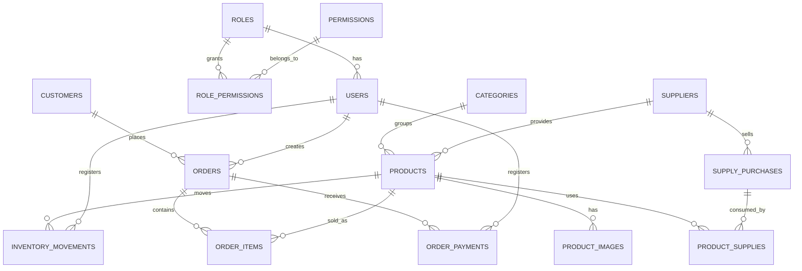

# Modelo entidad-relacion

Sistema administrativo para negocio de ropa femenina.

## Decisiones principales

- La aplicacion separa usuarios internos, clientes, productos, inventario, pedidos, compras de insumos y finanzas.
- Los pedidos guardan el precio y costo historico en `order_items`. Asi, si un producto cambia de precio o costo, los reportes antiguos siguen siendo correctos.
- El stock se modifica desde el backend usando transacciones SQL. Cada cambio queda registrado en `inventory_movements`.
- Los abonos de un pedido se registran en `order_payments`. El saldo pendiente se calcula con el total del pedido menos la suma de abonos.
- Los permisos se modelan con `roles`, `permissions` y `role_permissions`, no solo con un campo de rol. Esto permite crecer sin reescribir la autorizacion.
- Las finanzas usan `financial_transactions` para registrar ingresos y gastos, con referencia opcional a pedidos o compras de insumos.

## Entidades

### Seguridad

```txt
roles
  id
  name
  description

permissions
  id
  code
  description

role_permissions
  role_id
  permission_id

users
  id
  role_id
  name
  email
  password_hash
  active
  created_at
  updated_at
```

Relaciones:

```txt
roles 1 - N users
roles N - N permissions
```

### Productos e inventario

```txt
categories
  id
  name
  description
  active

suppliers
  id
  name
  phone
  email
  address
  notes
  active

products
  id
  category_id
  supplier_id
  name
  description
  size
  color
  sale_price
  manufacturing_cost
  stock
  min_stock
  active
  created_at
  updated_at

product_images
  id
  product_id
  image_url
  is_main
  created_at

inventory_movements
  id
  product_id
  user_id
  movement_type
  quantity
  previous_stock
  new_stock
  reason
  reference_type
  reference_id
  created_at
```

Relaciones:

```txt
categories 1 - N products
suppliers 1 - N products
products 1 - N product_images
products 1 - N inventory_movements
users 1 - N inventory_movements
```

Calculos:

```txt
profit = sale_price - manufacturing_cost
margin = ((sale_price - manufacturing_cost) / sale_price) * 100
low_stock = stock <= min_stock
```

### Clientes y pedidos

```txt
customers
  id
  name
  phone
  instagram
  address
  notes
  created_at
  updated_at

orders
  id
  customer_id
  user_id
  subtotal
  discount
  total
  status
  payment_method
  delivery_address
  observations
  created_at
  updated_at

order_items
  id
  order_id
  product_id
  quantity
  unit_price
  unit_cost
  subtotal

order_payments
  id
  order_id
  user_id
  amount
  payment_method
  notes
  paid_at
```

Relaciones:

```txt
customers 1 - N orders
users 1 - N orders
orders 1 - N order_items
products 1 - N order_items
orders 1 - N order_payments
users 1 - N order_payments
```

Estados de pedido:

```txt
pending
in_production
shipped
delivered
cancelled
```

Calculos:

```txt
order_subtotal = sum(order_items.subtotal)
order_total = subtotal - discount
amount_paid = sum(order_payments.amount)
pending_amount = order_total - amount_paid
customer_total_spent = sum(orders.total where status != 'cancelled')
```

### Compras de insumos

```txt
supply_purchases
  id
  supplier_id
  supply_type
  quantity
  unit_cost
  total_cost
  purchase_date
  observations
  created_at

product_supplies
  id
  product_id
  supply_purchase_id
  quantity_used
```

Relaciones:

```txt
suppliers 1 - N supply_purchases
products N - N supply_purchases via product_supplies
```

Tipos de insumo:

```txt
fabric
buttons
zippers
labels
other
```

### Finanzas

```txt
financial_transactions
  id
  type
  category
  amount
  description
  reference_type
  reference_id
  transaction_date
  created_at
```

Tipos:

```txt
income
expense
```

Referencias posibles:

```txt
order
supply_purchase
manual
```

## Diagrama Mermaid



